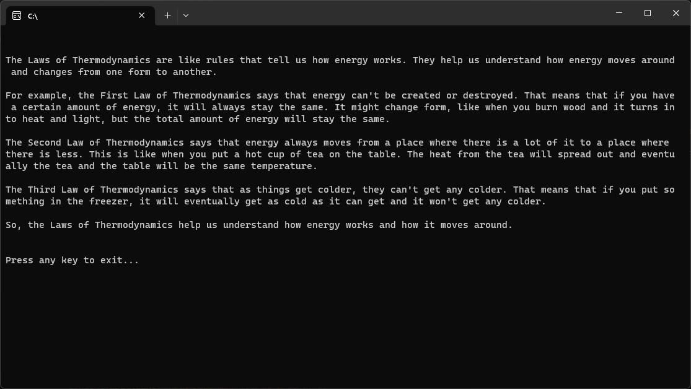

# Semantic Kernel Prototype

Semantic Kernel (SK) is a lightweight AI orchestration SDK enabling integration of AI Large Language Models (LLMs) with conventional programming languages. The SK extensible programming model combines natural language semantic functions, traditional code native functions, and embeddings-based memory unlocking new potential and adding value to applications with AI.

The below screeshot shows the output of a Semantic Function that is defined to generate an explaination of a given Physics law (in this case laws of thermodynamics) for explaining to a kid and with examples.

### Prompting Cheat Sheet

* Use curly braces {{...}} to embed expressions in prompts for SK to parse template and execute the expression

* To include a variable value in your text, use the {{$variableName}}.  Eg. To use a variable called name, write: Hello {{$name}}, welcome to Semantic Kernel!

* To call an external function and embed the result in your text, use {{namespace.functionName}} syntax. Eg. To use a function called weather.getForecast that returns the weather forecast for a given location, write: The weather today is {{weather.getForecast}}.

* The input variable is set automatically by the kernel when invoking a function. Eg. The code above is equivalent to: The weather today is {{weather.getForecast $input}}.

* To call an external function and pass a parameter to it, use {{namespace.functionName $varName}} or {{namespace.functionName "value"}} syntax. Eg. The weather today in {{$city}} is {{weather.getForecast $city}}.

* Branching features such as "if", "for", and code blocks are not part of SK's template language.

* Double curly braces have a special use case, they are used to inject variables, values, and functions into templates.

* Values can be enclosed using single quotes and double quotes. To avoid the need for special syntax, when working with a value that contains single quotes, it is recommended wrapping the value with double quotes. Similarly, when using a value that contains double quotes, wrap the value with single quotes.

* Backslash (\) is used for escape sequence. backslashes have a special meaning only when used in front of single quotes ('), double quotes (") and backslash (\).

### Useful Tools

* https://platform.openai.com/tokenizer
* https://marketplace.visualstudio.com/items?itemName=ms-semantic-kernel.semantic-kernel